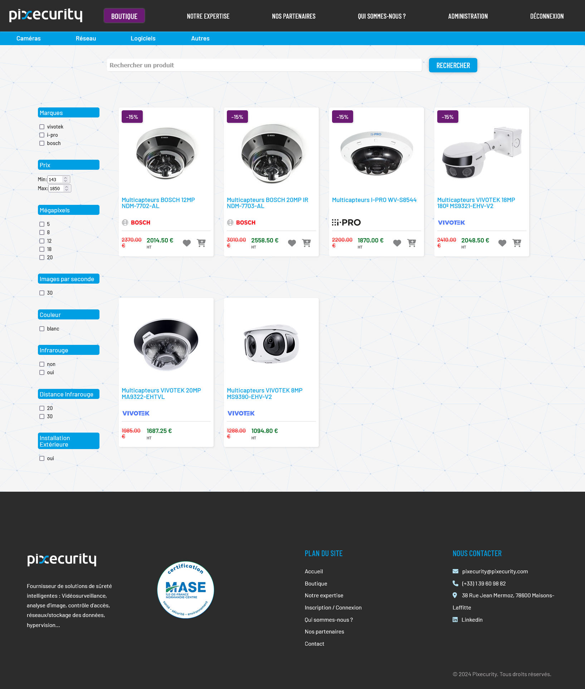
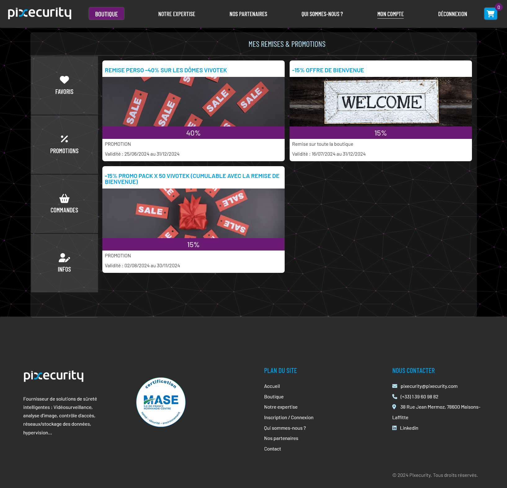

# Pixecurity
(https://www.pixecurity.com/)

## Présentation

Pixecurity est un fournisseur de solutions de sûreté intelligentes, incluant la vidéosurveillance, le contrôle d'accès, et des systèmes de gestion de données.

### Boutique en Ligne

Le site inclut une boutique en ligne pour des produits liés à la sûreté, tels que des caméras, logiciels et équipements réseau.

### Technologies et Packages Utilisés

Le projet utilise les technologies et packages suivants :

- **Frontend** :
  - [React](https://reactjs.org/) : bibliothèque JavaScript pour construire des interfaces utilisateur.
  - [Next.js](https://nextjs.org/) : framework React pour le développement d'applications web et de pages statiques.
  - [Sass](https://sass-lang.com/) : préprocesseur CSS qui facilite la gestion du style.

- **Gestion de Formulaires** :
  - [React Hook Form](https://react-hook-form.com/) : bibliothèque pour gérer les formulaires de manière simple et performante.
  - [Yup](https://github.com/jquense/yup) : bibliothèque de validation de schémas utilisée avec React Hook Form.

- **Internationalisation** :
  - [i18next](https://www.i18next.com/) : framework de localisation pour rendre les applications multilingues.
  - [next-i18next](https://github.com/isaachinman/next-i18next) : intégration d'i18next pour Next.js.

- **E-commerce** :
  - [Stripe](https://stripe.com/) : solution de paiement en ligne pour gérer les transactions.
  - [@stripe/react-stripe-js](https://stripe.com/docs/stripe-js) : intégration de Stripe avec React.

- **Animations** :
  - [AOS](https://michalsnik.github.io/aos/) : bibliothèque pour les animations au défilement.

- **Tests** :
  - [@testing-library/react](https://testing-library.com/docs/react-testing-library/intro/) : bibliothèque pour tester les composants React.
  - [@testing-library/jest-dom](https://github.com/testing-library/jest-dom) : matchers pour les assertions DOM.

- **Utilitaires** :
  - [js-cookie](https://github.com/js-cookie/js-cookie) : gestion des cookies.
  - [sweetalert2](https://sweetalert2.github.io/) : bibliothèque pour les alertes et les dialogues.
  - [slugify](https://github.com/sindresorhus/slugify) : bibliothèque pour créer des slugs.

### Screenshots

